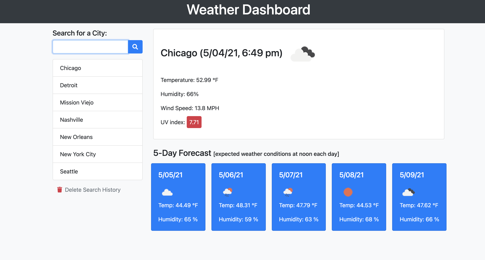

# Weather-Dashboard: Utilizing Server-Side APIs

- Deployed Link: https://ddaghlas.github.io/Weather-Dashboard/ 

- This is a weather dashboard that I have built to allow users to search for a city, which then displays the date and time, current temperature, humidity, wind speed and UV index; also includes a 5 day forecast for the user generated location. I utilized the OpenWeather One Call API (https://openweathermap.org/api/one-call-api) to retrieve the weather data for each of the cities. 

- This weather application runs in the users browser and features dynamically updat4ed HTML and CSS. JS was used to store the users city search history within their local storage using the localStorage function. 

- I have also included a function that allows the user to "delete" or "clear" all of their search history. This was applied because of the data being stored to local storage; if the page is refreshed, the user data will still be displayed in the storage history. This function allows the user to start from scratch, should they wish to. 

